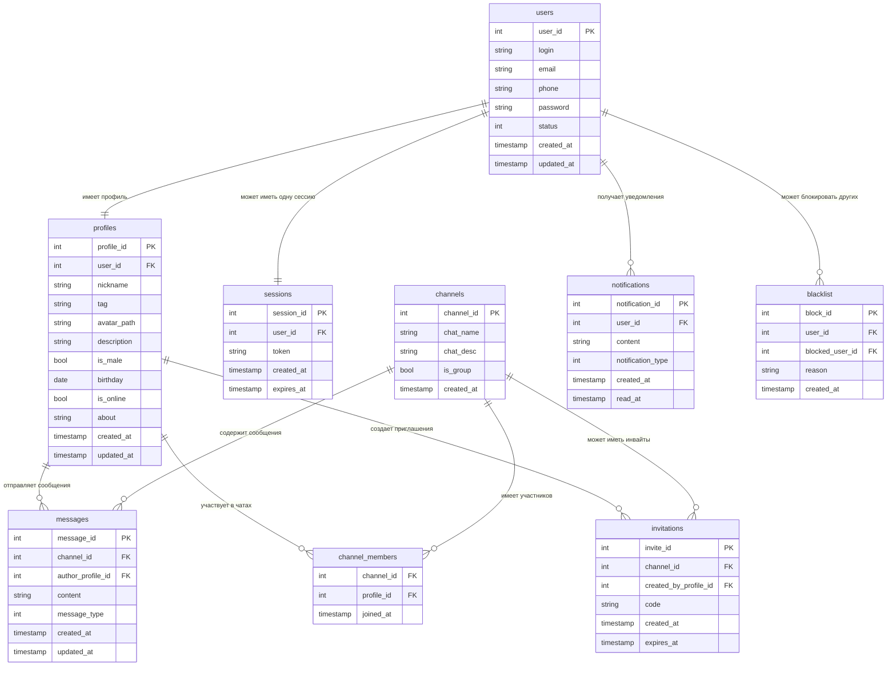

# Выполнение задания по предмету "Высоконагруженные системы" : Курсовая работа "Разработка сервиса Discord"

## Тема и целевая аудитория

### Распределение целевой аудитории ([источник_2]) ([источник_3])

- Половое распределение:
    - Мужчины: 67%
    - Женщины: 33%
- Возрастное распределение:
    - от 16 до 24: 20%
    - от 25 до 34: 53%
- Географическое распределение:
    - США: 27%
    - Бразилия: 12.8%
    - Россия: 4.4%
    - Индия: 4.24 %
    - Великобритания: 3.85%

### Фунционал

#### Основной MVP функционал
- Сервис авторизации:
    - Регистрация 
    - Вход в аккаунт
    - Выход из аккаунта
- Профили пользователя:
    - Изменение профиля
    - Добавление аватарки
    - Изменение аватарки профиля
- Группы:
    - Создание группы
    - Удаление группы
    - Добавление в группу участника
    - Исключение из группы участника
    - Изменение параметров группы
    - Добавление пользователя в админы группы
- Чаты
    - Присоединиться к чату
    - Выйти из чата
    - Написать сообщение
    - Изменить сообщение
    - Удалить сообщение
    - Отправка медиа в чат
- Аудио чаты
    - Создать аудиочата
    - Удалить аудиочата
    - Присоединиться к аудиочату
    - Выйти из аудиочата
    - Включение/выключение микрофона
- Сообщества
    - Создание сообщества
    - Удаление сообщества
    - Добавление в сообщество участника
    - Исключение из сообщества участника
    - Изменение параметров сообщества
    - Добавление пользователя в админы сообщества
    - Добавление тематики сообщества
    - Удаление тематики сообщества

### Отличие от конкурентов ([источник_5]):

Discord создаются полноценные серверы, которые служат аналогом больших чатов по интересам или рабочим пространствам. Сервер можно структурировать с помощью категорий и каналов — текстовых, голосовых и видео. Это позволяет разделять общение по темам и типам активности: обсуждения, созвоны, демонстрация экрана, неформальное общение.

Ключевую роль играет система ролей и прав доступа. На каждом сервере администраторы назначают роли (например, участник, модератор, админ, гость), и от этого зависят возможности пользователей: доступ к каналам, право писать сообщения, подключаться к аудио, включать видео, управлять другими пользователями. Грамотная настройка ролей делает общение удобным и упорядоченным, а также снижает нагрузку на модераторов.

### Конкурентные площадки ([источник_1])
- Steam Chat
- Teamspeak ([источник_4])
- Mumble

### Продуктовые метрики (2023 г.) ([источник_3])

| Название метрик                               | Значение |
| :-------------------------------------------- | :------- |
| MAU (mm)                                      | 154      |
| DAU (mm)                                      | 26.5     |
| Активные сервера(mm)                          | 6.7      |
| Количество зарегистированных польззователей   | 563      |
| Ограничение на объем файла     ([источник_5]) | 25 МБ    |

## Расчет нагрузки

### Технические метрики  

**Сообщения** – 850 млн/день ([источник_7])  

**Предположительный размер сообщения** – ~1 КБ (ограничение 2000 символов в 1 сообщении, [источник_5])  

> **Формула:**  
> `Сообщения в день × Размер сообщения`  
>   
> **Расчёт:**  
> `850e6 × 1 КБ = ~0.85e9 КБ ≈ 810 ГБ ≈ ~0.8 ТБ в сутки`  
> `≈ 310 ТБ в год`  

Также делаем предположение, что 5% из них - является медиа сообщениями
На каждое сообщение накладывается лимит 25МБ, предполагаем худший случай, что каждое сообшение - ровно 25Мб тогда

> **Формула:**  
>   
> **Расчёт:**  
> `850e6 × 0.05 × 25 МБ = 1.0625e9 МБ ≈ 1.06e6 ГБ ≈ 1062.5 ТБ ≈ ~1.06 ПБ в сутки`  
> `≈ 387 ПБ в год`  
---

**Голосовые чаты** – 4 млрд минут голосового общения ([источник_6])  

| Кодек / Качество     | Битрейт (Кбит/с) | Битрейт (КБ/с) | Размер аудио в минуту | Расчётный объём за сутки (4 млрд минут) |
|-----------------------|------------------|----------------|------------------------|------------------------------------------|
| Opus (стандартное)   | 64               | 8              | ~480 КБ                | ~1.92 ПБ                                 |
| Opus (высокое)       | 96               | 12             | ~720 КБ                | ~2.88 ПБ                                 |
| Opus (экономное)     | 32               | 4              | ~240 КБ                | ~0.96 ПБ                                 |
| Телефонное (G.711)   | 64               | 8              | ~480 КБ                | ~1.92 ПБ                                 |

**Предположительный битрейт для приложения - стандартное качество OPUS**, то есть битрейт – 8 КБ/с, дневной объем хранилища - 1.92 Пб 

---

### Расчет хранилища пользователя 

**Допущения для раcчета**: 

Допущения для расчёта:

- Аватарка: лимит 25 МБ, средний размер — 1 МБ, в расчётах на пользователя учтём 0.5 МБ (среднее распределение, часть пользователей без аватарок).
- Метаданные аккаунта: 1 МБ (никнейм, email, хэши паролей, настройки, список друзей, список серверов).
- Сообщения: всего пользователи отправляют 850 млн/день → ~0.8 ТБ/день.
- Метаданные чата (серверы, каналы): 20% от объёма сообщений.
- Аудиочаты: хранение не требуется.
- Медиафайлы: 5% сообщений содержат вложения, средний размер вложения ~25 МБ.

Также необходимо учитывать средний прирост аудитории -  9.4% ([источник_15])

| Тип данных               | Размер на 1 юзера | Кол-во юзеров       | Суточный объём   | Годовой объём (без роста) | Годовой объём (с ростом 9.4%) |
| ------------------------ | ----------------: | -----------------: | ---------------: | ------------------------: | ----------------------------: |
| **Профили (аватарки)**   |            0.5 МБ |       563 млн       |               - |                ~268.5 ТБ  |                             - |
| **Профили (метаданные)** |              1 МБ |       563 млн       |               - |                  ~536.9 ТБ |                             - |
| **Текстовые сообщения**  |                 - |  26.5 млн DAU      |       ~0.8 ТБ    |                  ~288.9 ТБ |                    ~315.3 ТБ |
| **Метаданные чатов**     |                 - |                   - |       ~0.16 ТБ   |                   ~57.8 ТБ |                     ~63.2 ТБ |
| **Медиафайлы**           |                 - |  26.5 млн DAU      |     ~1062.5 ТБ   |               ~361.2 ПБ    |                     ~395.2 ПБ |
| **ИТОГО**                |                   |                     |   ~1.06 ПБ/день  |               ~362.3 ПБ    |                     ~396.4 ПБ |

### RPS (requests per second)

**Допущения для раcчета**: 

Для расчета пиковой нагрузки необходим пиковый коэффицент. Так как специфика дискорда заключается в том, что он в первую очередь предназначен для коммуникации игороков, поэтому основной всплеск приходится на вечер будней(19:00-2:00). В остальное время предполагается, что пользователи и ли работают в будни, или их активность равномерно распределена(выходные). Также отдельные пики будут приходиться на релизы крупных игр(например silksong), а также учитывать то, что во многом активность неплавная и сопровождается частыми перепадами. В этом можно убедиться взяв для анализа график активности Steam ([источник_14]). По сравнению с утром, вечерний трафик может увеличиваться в 1.5-2 раза. Также можно сравнить Discord с сервисом Netflix из-за схожести времени спада/падений,а также особенности потоковой передачи ([источник_15]). У Netflix - примерный пиковый коэффицент - 3.0. Поэтому можно предполагать аналогичный 

 Считаем, что коэффицент пика равен 3.0, средний пиковый коэффицент обычно считается как 2.5, однако тут нужно учитывать специфику Discord. Приложение предназначено для коммуникации игроков,  ([источник_8])  

Расчет среднего RPS: (Событий в день) / (24 часа * 3600 секунд).
Расчет пикового RPS: Средний RPS * Пиковый коэффициент (3.0).

### Расчет трафика

| Категория (MVP)              | Сценарии (MVP-группировка)                                                                                                       | Событий в день | На пользователя | Средний RPS | Пиковый RPS | Размер данных | Средний трафик (Гбит/с) | Пиковый трафик (Гбит/с) | Суточный объём |
| ---------------------------- | -------------------------------------------------------------------------------------------------------------------------------- | -------------: | --------------: | ----------: | ----------: | ------------: | ----------------------: | ----------------------: | -------------: |
| **Авторизация**              | Регистрация, Вход в аккаунт, Выход из аккаунта                                                                                   |          53.0M |             2.0 |         614 |       1 842 |          1 КБ |                   0.005 |                   0.015 |        \~53 ГБ |
| **Профиль пользователя**     | Изменение профиля, Добавление/изменение аватарки                                                                                 |          26.5M |             1.0 |         307 |         921 |          5 КБ |                   0.012 |                   0.036 |       \~132 ГБ |
| **Группы (метаданные)**      | Создание/удаление группы, Добавление/исключение участника, Изменение параметров, Добавление админов                              |          26.5M |             1.0 |         307 |         921 |          2 КБ |                   0.005 |                   0.015 |        \~53 ГБ |
| **Сообщества (метаданные)**  | Создание/удаление сообщества, Добавление/исключение участника, Изменение параметров, Добавление админов, Добавление/удаление тем |          26.5M |             1.0 |         307 |         921 |          2 КБ |                   0.005 |                   0.015 |        \~53 ГБ |
| **Чаты (текстовые)**         | Присоединение/выход, Написать сообщение, Изменить сообщение, Удалить сообщение                                                   |         807.5M |            30.5 |       9 346 |      28 038 |          1 КБ |                   0.075 |                   0.224 |     \~807.5 ГБ |
| **Запросы ленты сообщений**  | Получение истории чатов, обновление списка сообщений (читающая нагрузка)                                                         |         2 650M |           100.0 |      30 671 |      92 013 |         50 КБ |                  122.68 |                  368.04 |     \~132.5 ТБ |
| **Загрузка медиафайлов**     | Отправка медиа в чат                                                                                                             |          42.5M |             1.6 |         492 |       1 476 |         25 МБ |                    98.4 |                   295.2 |    \~1062.5 ТБ |
| **Аудио-чаты (метаданные)**  | Создание/удаление аудиочата, Присоединение/выход, Вкл/выкл микрофона                                                             |         106.0M |             4.0 |       1 227 |       3 681 |          2 КБ |                   0.020 |                   0.059 |       \~212 ГБ |
| **Голосовая связь (трафик)** | Потоковая передача аудио (Opus 64 кбит/с, стандартное качество)                                                                  |     4 000M мин |         151 мин |         210 |         630 |     64 Кбит/с |                   177.8 |                   533.3 |      \~1.92 ПБ |

## Глобальная балансировка нагрузки

### Распределение пользователей

Рассмотрим примерное распределение трафика по странам ([источник_9], [источник_10]):

Видно, что основная концентрация пользователей приходит на:
- **США** (25-30% трафика)
- **Канаду** (2-3%)
- **Европейские страны**

Для получения приближенной картины ([источник_11]):

Можно видеть, что основное количество пользователей располагается на восточном побережье США и в центральной Европе (Германия, Франция, Великобритания).

Учитывая основное местоположение магистральных кабелей ([Submarine Cable Map]) и точек обмена интернет-трафиком ([IXP]), оптимальным является размещение дата-центров (ДЦ) в узлах с наилучшей связностью. Это позволит минимизировать задержку (latency) для ключевых регионов аудитории.Из этого следует, что оптимальнее разместить ДЦ в следующих локациях:

**Северная Америка** (25–30% трафика):
- **Нью-Йорк** — восточное побережье, доступ к AMS/Лондону через трансатлантические кабели
- **Сан-Франциско** — западное побережье, маршруты в Азию
- **Майами** — маршруты к Латинской Америке

**Европа:**
- **Амстердам** (AMS-IX — крупнейший IX Европы)
- **Лондон** (высокая связанность, хаб трансатлантических линий)
- **Франкфурт** (DE-CIX, центральная точка европейского трафика)

**Азия:**
- **Сингапур** (юго-восточная Азия)
- **Токио** (восточная Азия)
- **Мумбаи** (южная Азия)

**Южная Америка:**
- **Сан-Паулу**
- **Рио-де-Жанейро**

### Схемы балансировки

#### **DNS балансировка**

В связи с отдельными требованиями скорости и низкой задержки для домена аудиочатов, стоит использовать **latency-based DNS**. Этот алгоритм обеспечивает распределение среди сервисов бэкенда на разные сервера, не жертвуя при этом скоростью. Благодаря latency-based DNS мы сможем сократить задержку при передаче аудиопакетов и при этом, в отличие от GeoDNS, который ориентируется на географическое положение IP, latency-DNS обеспечивает более точный выбор при использовании VPN или провайдеров с нетипичной маршрутизацией.

#### **Anycast балансировка**

Для домена аудиочатов и других сервисов, для которых критична задержка, рекомендуется использовать **Anycast** ([источник_19]) . В этом подходе один публичный IP объявляется сразу из нескольких дата-центров через BGP. Пользовательский трафик автоматически маршрутизируется в ближайший ДЦ, что снижает задержки и повышает отказоустойчивость.

#### **Разделение применения DNS и Anycast**

Приоритетная задача при выборе методов балансировки - обеспечить как можно меньшую задержку для аудиочатов, которые являются главным доменом приложения. При DNS lookup IP адрес сервера потом кешируется на стороне клиента/сервера провайдера, лучше использовать комбинацию DNS и Anycast для выбора ближайшего сервера.

**Алгоритм работы:**

1. **Latency-DNS определяет ближайший регион** для пользователя (например, eu-west, us-east)
2. **DNS возвращает IP регионального балансировщика**
3. **Anycast используется внутри региона** или континента — один и тот же IP анонсируется из нескольких PoP внутри региона, и пакеты доставляются в ближайший узел

**Полная схема:**
- Клиент выполняет DNS-запрос → получает IP ближайшего региона
- Устанавливает соединение с Anycast-IP внутри региона → попадает в локальный PoP
- PoP перенаправляет трафик на ближайший ДЦ
- При сбое PoP BGP автоматически перенаправляет трафик в соседний ДЦ
- Если регион недоступен — DNS health check исключает его из ответов

Таким образом, **DNS управляет выбором региона**, а **Anycast — доставкой пакетов внутри него**. Это снижает влияние DNS-кеширования и обеспечивает минимальное время реакции при сбоях.

### Механизм регулировки трафика между ДЦ

**Для различных типов трафика:**

- **Текстовые сообщения и медиафайлы** — применяется асинхронная репликация данных между ДЦ, преимущественно по географическому принципу:
  - США → первичный ДЦ США, резервный — Европа
  - Европа → первичный ДЦ Европа, резервный — США

- **Аудиочаты** — трафик обрабатывается строго локально в пределах одного ДЦ. Голосовые пакеты маршрутизируются внутри кластера, чтобы минимизировать задержку и избежать межрегиональных хопов.

**В случае перегрузки или сбоя одного ДЦ:**

- Часть трафика автоматически перераспределяется на резервные ДЦ с помощью DNS или Anycast
- Балансировка происходит с учётом метрик latency, RPS и нагрузки ресурсов
- Используется мониторинг состояния ДЦ и автоматическое обновление записей DNS
- При восстановлении региона трафик возвращается обратно постепенно, чтобы избежать пиковых нагрузок

## Локальная балансировка нагрузки

### Функциональное разбиение по доменам

В случае Discord, согласно [MVP](#основной-mvp-функционал),  выделить 3 основных домена: 
1) Домен авторизации
    Основные функции: регистрация, вход/выход из аккаунта, хранение учётных данных и настроек пользователей.
    Для него требуется особая отказоустойчивоть и обеспечение сохранности данных пользователей. На него не будет накладываться особая нагрузка, в связи с тем, что авторизация/регистрация выполняются довольно редко(максимум 1-2 раза в день на 1 пользователя, пользователи необязательно будут выходить из аккаунтов)

2) Домен сообщений 
    Основные функции: отправка, редактирование, удаление текстовых сообщений, хранение медиафайлов, метаданных чатов и пользователей.
    Обращение к этому домену уже идет чаще и скорость, несмотря на то, что является некритичной по сравнению с аудиочатом, преобретает более важный статус
3) Домен аудиочатов
    Основные функции: потоковое аудио, управление микрофоном, подключение/отключение участников, управление голосовыми каналами. 
    Самый важный домен, для него как скорость соединения так и потеря пакетов может быть критична, рекомендуется поместить внутри каждого ДЦ.  

Также мы предполагаем, что ввиду продуктовых требований, каждые запросы в пределах одного домена будут обрабатываться одинаково по времени, все запросы имеют одинаковый приоритет и размер. 

### Сравнение методов локальной балансировки

| Уровень       | Методы балансировки                           | Плюсы                                                                 | Минусы                                                                 | Использование в Discord                              |
|---------------|-----------------------------------------------|----------------------------------------------------------------------|------------------------------------------------------------------------|------------------------------------------------------|
| DNS-уровень   | - Geo-based - Round Robin - Weighted RR | - Простота - Глобальная балансировка - Высокая доступность      | - Долгий TTL - Нет проверки здоровья - Нет учёта реальной нагрузки | Первоначальная маршрутизация по регионам             |
| L4 (Transport)| - Round Robin - Least Connections - Source IP Hash | - Высокая производительность - Низкая задержка - Простота       | - Не видит содержимое запроса - Нет SSL termination                  | Балансировка голосового трафика, подключения к Gateway |
| L7 (Application)| - URL-based - Header-based - Cookie-based - Least Response Time | - Умная маршрутизация - SSL termination - Content awareness     | - Более высокая задержка - Сложность настройки                      | Балансировка API запросов, WebSocket соединений       |
| Anycast       | - Shortest path (BGP)                         | - Автоматическая отказоустойчивость - Минимальная задержка - DDoS protection | - Сложность настройки BGP - Требует собственные IP-блоки             | Голосовые серверы, критичные к задержке сервисы       |

---

### Ограничители производительности

- SSL Termination ([источник_16]) — основной ограничитель для L7 балансировщиков.  Это вызвано тем, что процесс расшифровки входящих SSL/TLS соединений требует значительных вычислительных ресурсов при установлении соединения и симметричного при передаче данных.

- Пропускная способность сети  ([источник_17]) — ограничение физических интерфейсов.  Это ограничение определяется скоростью сетевых карт, внутренней шиной коммутации между портами и возможностями обработки пакетов в секунду.

- Количество одновременных соединений — ограничение RAM и TCP-таблиц ядра.  Каждое соединение требует выделения 16-32 КБ памяти для буферов и структур данных, что создает существенную нагрузку на систему при высоких нагрузках.

- Процессорная мощность — обработка алгоритмов балансировки (Least Conn, RR). Вычислительная сложность варьируется от O(1) для простых алгоритмов до O(n) для более сложных методов распределения нагрузки

### Формулы резервирования

([источник_18])

- N+1 — для некритичных сервисов (веб, статика)  
- N×2 — для критичных сервисов и сервисов с непредсказуемыми пиками (стриминг, ивенты)  

### Расчёт количества балансировщиков

#### L7 балансировщики (SSL Termination)

- Пиковый RPS = **140,000**  [Ссылка на расчет](#расчет-нагрузки)
- Производительность 1 ноды = **50,000 RPS**  
- Необходимо = 140,000 / 50,000 = **≈3 ноды**  
- С резервированием (N+1) → **4 ноды на регион**

#### L4 балансировщики (Пропускная способность)

- Пиковый трафик = **533.3 Гбит/с**   [Ссылка на расчет](#расчет-нагрузки)
- Пропускная способность 1 ноды = **100 Гбит/с**  
- Необходимо = 533.3 / 100 = **≈6 нод**  
- С резервированием (N+1) → **7 нод на регион**

#### Голосовые серверы (N×2)

- Ожидаемая нагрузка = **630 потоков**  [Ссылка на расчет](#расчет-нагрузки)
- Производительность 1 ноды = **500 потоков**  
- Необходимо = 630 / 500 = **≈2 ноды**  
- С резервированием (N×2) → **4 ноды на регион**

---

### Механизмы автоматического регулирования

1) Health Checking — постоянный мониторинг состояния бэкенд-серверов через HTTP/HTTPS путем запросов на эндпоинты /health или TCP ping. Проверки выполняются каждые 5-10 секунд. При неуспешном ответе сервер исключается из пула балансировки. После восстановления возвращается в работу после нескольких успешных проверок подряд.

2) Circuit Breaker - автоматическое отключение неисправных серверов при превышении порога в 50% ошибок за 30 секунд. Все последующие запросы к такому серверу немедленно отклоняются без реальных попыток соединения, предотвращая каскадные сбои. 

3) Auto-scaling — динамическое добавление или удаление вычислительных нод на основе метрик нагрузки. Срабатывает при: загрузке CPU > 70%, достижении 80% от максимальной пропускной способности RPS, или задержке ответа > 200ms. 

4) Traffic Shifting — плавное перераспределение трафика между серверами при развертывании новых версий или замене оборудования. Реализуется через взвешенное распределение по схеме 10% → 50% → 100%, что позволяет постепенно наращивать нагрузку на новые ноды и отслеживать их стабильность перед полным переходом.

5) Load Shedding — стратегический сброс части трафика при экстремальных нагрузках для сохранения работоспособности критически важных функций. Система определяет менее важные запросы и возвращает им HTTP 503, сохраняя ресурсы для основных операций вроде голосовой связи и отправки сообщений.

## Логическая схема БД

### ER Диаграмма базы данных

### Описание таблиц
| Таблица             | Назначение                   | Основные поля                                                                                                                                     | Ограничения / консистентность                                                                                                                               | Связи                                                                     | Средний размер записи | QPS   | Пиковый QPS | Объём записи/с (средний) | Объём записи/с (пиковый) |
| ------------------- | ---------------------------- | ------------------------------------------------------------------------------------------------------------------------------------------------- | ----------------------------------------------------------------------------------------------------------------------------------------------------------- | ------------------------------------------------------------------------- | --------------------- | ----- | ----------- | ------------------------ | ------------------------ |
| **users**           | Аккаунт пользователя         | `user_id`, `login`, `email`, `phone`, `password`, `status`, `created_at`, `updated_at`                                                            | NOT NULL, `login < 50`, `email < 30`, `password < 50`, `status` ENUM (`active`, `banned`, `inactive`), `login UNIQUE`, `email UNIQUE`                       | `1 → 1` с `profiles`, `sessions`; `1 → N` с `notifications`, `blacklist`  | 134 B                 | 307   | 921         | 41 KB/s                  | 123 KB/s                 |
| **profiles**        | Профили пользователей        | `profile_id`, `user_id`, `nickname`, `tag`, `avatar_path`, `description`, `is_male`, `birthday`, `is_online`, `about`, `created_at`, `updated_at` | NOT NULL, `nickname < 20` и UNIQUE, `description < 1000`, `is_male` BOOLEAN, `birthday <= текущая дата - 14 лет`, `tag` ENUM (`default`, `vip`, `moderator`) | `N → 1` с `users`; `1 → N` с `messages`, `channel_members`, `invitations` | 345 B                 | 307   | 921         | 106 KB/s                 | 318 KB/s                 |
| **sessions**        | Активные сессии              | `session_id`, `user_id`, `token`, `created_at`, `expires_at`                                                                                      | NOT NULL, `user_id` FK, `expires_at > текущая дата`, `user_id UNIQUE`, `token UNIQUE`                                                                       | `1 → 1` с `users`                                                         | 74 B                  | 614   | 1 842       | 45 KB/s                  | 137 KB/s                 |
| **channels**        | Личные и групповые чаты      | `channel_id`, `chat_name`, `chat_desc`, `is_group`, `created_at`                                                                                  | NOT NULL, `chat_name < 20`, `chat_desc < 200`, `is_group` BOOLEAN, `created_at <= текущая дата`                                                             | `1 → N` с `messages`, `channel_members`, `invitations`                    | 133 B                 | 307   | 921         | 41 KB/s                  | 123 KB/s                 |
| **channel_members** | Связь профилей и чатов       | `channel_id`, `profile_id`, `joined_at`                                                                                                           | NOT NULL, `joined_at <= текущая дата`, `(channel_id, profile_id)` UNIQUE                                                                                    | `M ↔ N` между `profiles` и `channels`                                     | 16 B                  | 307   | 921         | 4.9 KB/s                 | 14.7 KB/s                |
| **messages**        | Сообщения в чатах            | `message_id`, `channel_id`, `author_profile_id`, `content`, `message_type`, `created_at`, `updated_at`                                            | NOT NULL, `content < 1000`, `message_type` ENUM (`text`, `image`, `voice`, `system`), `created_at <= текущая дата`                                           | `N → 1` с `profiles`, `channels`                                          | 1 056 B               | 9 346 | 28 038      | 9.6 MB/s                 | 28.8 MB/s                |
| **invitations**     | Приглашения в чаты           | `invite_id`, `channel_id`, `created_by_profile_id`, `code`, `created_at`, `expires_at`                                                            | NOT NULL, `code UNIQUE`, `expires_at > текущая дата`                                                                                                        | `N → 1` с `profiles`, `channels`                                          | 48 B                  | 1 227 | 3 681       | 58 KB/s                  | 174 KB/s                 |
| **notifications**   | Уведомления пользователя     | `notification_id`, `user_id`, `notification_type`, `content`, `created_at`, `read_at`                                                             | NOT NULL, `content < 200`, `notification_type` ENUM, `created_at <= текущая дата`, `read_at >= created_at`                                                  | `N → 1` с `users`                                                         | 228 B                 | 307   | 921         | 70 KB/s                  | 211 KB/s                 |
| **blacklist**       | Заблокированные пользователи | `block_id`, `user_id`, `blocked_user_id`, `reason`, `created_at`                                                                                  | NOT NULL, `reason < 100`, `created_at <= текущая дата`, `(user_id, blocked_user_id)` UNIQUE                                                                 | `N → 1` с `users` (оба поля)                                              | 120 B                 | 307   | 921         | 36 KB/s                  | 110 KB/s                 |

**Триггеры и консистентности**

1) created_at, updated_at - автоматическое обновление на текущее дату и время(например CURRENT_TIMESTAMP)

2) При удалении чатов - удалить сообщения, приглашения

3) При удалении пользователя - удалить профиля, сесиии, уведомления

### Нагрузка на запись [Ссылка на расчет](#расчет-нагрузки)

| Таблица             | Поля                                                                                                                               | Средний размер записи | QPS   | Пиковый QPS | Объём записи/с (средний) | Объём записи/с (пиковый) |
| ------------------- | ---------------------------------------------------------------------------------------------------------------------------------- | --------------------- | ----- | ----------- | ------------------------ | ------------------------ |
| **users**           | `user_id (4B), login (20B), email (25B), phone (15B), password (50B), status (4B), created_at (8B), updated_at (8B)`               | 134 B                 | 307   | 921         | 41 KB/s                  | 123 KB/s                 |
| **profiles**        | `profile_id (4B), user_id (4B), nickname (20B), avatar_path (50B), is_online (1B), about (200B), created_at (8B), updated_at (8B)` | 345 B                 | 307   | 921         | 106 KB/s                 | 318 KB/s                 |
| **sessions**        | `session_id (4B), user_id (4B), token (50B), created_at (8B), expires_at (8B)`                                                     | 74 B                  | 614   | 1 842       | 45 KB/s                  | 137 KB/s                 |
| **channels**        | `channel_id (4B), name (20B), topic (100B), is_group (1B), created_at (8B)`                                                        | 133 B                 | 307   | 921         | 41 KB/s                  | 123 KB/s                 |
| **channel_members** | `channel_id (4B), profile_id (4B), joined_at (8B)`                                                                                 | 16 B                  | 307   | 921         | 4.9 KB/s                 | 14.7 KB/s                |
| **messages**        | `message_id (4B), channel_id (4B), author_profile_id (4B), content (1024B), message_type (4B), created_at (8B), updated_at (8B)`   | 1 056 B               | 9 346 | 28 038      | 9.6 MB/s                 | 28.8 MB/s                |
| **invitations**     | `invite_id (4B), channel_id (4B), created_by_profile_id (4B), code (20B), created_at (8B), expires_at (8B)`                        | 48 B                  | 1 227 | 3 681       | 58 KB/s                  | 174 KB/s                 |
| **notifications**   | `notification_id (4B), user_id (4B), content (200B), notification_type (4B), created_at (8B), read_at (8B)`                        | 228 B                 | 307   | 921         | 70 KB/s                  | 211 KB/s                 |
| **blacklist**       | `block_id (4B), user_id (4B), blocked_user_id (4B), reason (100B), created_at (8B)`                                                | 120 B                 | 307   | 921         | 36 KB/s                  | 110 KB/s                 |

## Список источников 

1) https://trends.rbc.ru/trends/industry/66fe701f9a7947ee414c2333
2) https://analyzify.com/statsup/discord 
3) https://helplama.com/discord-statistics/
4) https://www.tsviewer.com/index.php?page=teamspeak_statistics
5) https://habr.com/ru/articles/495336/
6) https://www.cloudwards.net/discord-statistics
7) https://www.businessofapps.com/data/discord-statistics
8) https://discord.com/blog/how-discord-stores-trillions-of-messages
9) https://www.semrush.com/website/discord.com/overview/
10) https://www.similarweb.com/website/discord.com/#geography
11) https://www.techinsider.ru/gadgets/254242-karta-vsekh-ustroystv-s-vykhodom-v-internet-2016/
12) https://www.submarinecablemap.com
13) https://www.internetexchangemap.com/#/building/1831
14)  https://store.steampowered.com/charts/
15) https://www.bankmycell.com/blog/number-of-discord-users/#:~:text=Growth%20of%20Daily%20Active%20Users,users%20from%202023%20to%202025
16) https://www.geeksforgeeks.org/computer-networks/ssl-termination/
17) https://www.intel.com/content/www/us/en/products/sku/128970/intel-ethernet-connection-c827im1/specifications.html
18) https://www.coresite.com/blog/data-center-redundancy-n-1-vs-2n-1
19) https://anycast.com/what-it-leaders-need-to-know-about-bgp-anycast/

[источник_1]: https://trends.rbc.ru/trends/industry/66fe701f9a7947ee414c2333 "Топ-7 аналогов Discord, которые работают в России"

[источник_2]: https://analyzify.com/statsup/discord "Discord Statistics"

[источник_3]: https://helplama.com/discord-statistics/ "Discord Revenue and Usage Statistics 2025"

[источник_4]: https://www.tsviewer.com/index.php?page=teamspeak_statistics "TeamSpeak 3 Statistics"

[источник_5]: https://habr.com/ru/articles/495336/ "Discord как корпоративный мессенджер и не только"

[источник_6]: https://www.cloudwards.net/discord-statistics "20 Discord Statistics, Facts and Trends for 2025"

[источник_7]: https://www.businessofapps.com/data/discord-statistics "Discord Revenue and Usage Statistics (2025)"

[источник_8]:  https://discord.com/blog/how-discord-stores-trillions-of-messages "How Discord Stores Trillions of Messages"

[источник_9]: https://www.semrush.com/website/discord.com/overview/ "discord.com August 2025 Traffic Stats"

[источник_10]:  https://www.similarweb.com/website/discord.com/#geography

[источник_11]:  https://www.techinsider.ru/gadgets/254242-karta-vsekh-ustroystv-s-vykhodom-v-internet-2016/

[Submarine Cable Map]: https://www.submarinecablemap.com

[IXP]: https://www.internetexchangemap.com/#/building/1831

[источник_14]: https://store.steampowered.com/charts/

[источник_15]: https://www.bankmycell.com/blog/number-of-discord-users/#:~:text=Growth%20of%20Daily%20Active%20Users,users%20from%202023%20to%202025.

[источник_16]: https://www.geeksforgeeks.org/computer-networks/ssl-termination/

[источник_17]: https://www.intel.com/content/www/us/en/products/sku/128970/intel-ethernet-connection-c827im1/specifications.html

[источник_18]: https://www.coresite.com/blog/data-center-redundancy-n-1-vs-2n-1

[источник_19]: https://anycast.com/what-it-leaders-need-to-know-about-bgp-anycast/