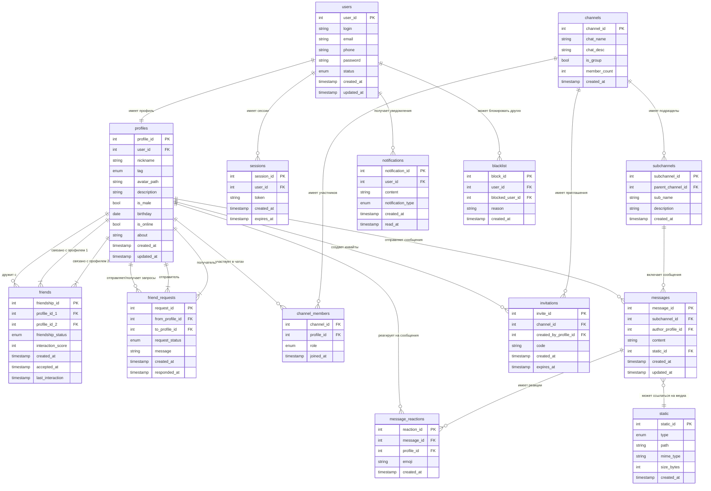

# Выполнение задания по предмету "Высоконагруженные системы" : Курсовая работа "Разработка сервиса Discord"

## Тема и целевая аудитория

### Распределение целевой аудитории ([источник_2]) ([источник_3])

- Половое распределение:
    - Мужчины: 67%
    - Женщины: 33%
- Возрастное распределение:
    - от 16 до 24: 20%
    - от 25 до 34: 53%
- Географическое распределение:
    - США: 27%
    - Бразилия: 12.8%
    - Россия: 4.4%
    - Индия: 4.24 %
    - Великобритания: 3.85%

### Фунционал

#### Основной MVP функционал
- Сервис авторизации:
    - Регистрация 
    - Вход в аккаунт
    - Выход из аккаунта
- Профили пользователя:
    - Изменение профиля
    - Добавление аватарки
    - Изменение аватарки профиля
- Группы:
    - Создание группы
    - Удаление группы
    - Добавление в группу участника
    - Исключение из группы участника
    - Изменение параметров группы
    - Добавление пользователя в админы группы
- Чаты
    - Присоединиться к чату
    - Выйти из чата
    - Написать сообщение
    - Изменить сообщение
    - Удалить сообщение
    - Отправка медиа в чат
- Аудио чаты
    - Создать аудиочата
    - Удалить аудиочата
    - Присоединиться к аудиочату
    - Выйти из аудиочата
    - Включение/выключение микрофона
- Сообщества
    - Создание сообщества
    - Удаление сообщества
    - Добавление в сообщество участника
    - Исключение из сообщества участника
    - Изменение параметров сообщества
    - Добавление пользователя в админы сообщества
    - Добавление тематики сообщества
    - Удаление тематики сообщества

### Отличие от конкурентов ([источник_5]):

Discord создаются полноценные серверы, которые служат аналогом больших чатов по интересам или рабочим пространствам. Сервер можно структурировать с помощью категорий и каналов — текстовых, голосовых и видео. Это позволяет разделять общение по темам и типам активности: обсуждения, созвоны, демонстрация экрана, неформальное общение.

Ключевую роль играет система ролей и прав доступа. На каждом сервере администраторы назначают роли (например, участник, модератор, админ, гость), и от этого зависят возможности пользователей: доступ к каналам, право писать сообщения, подключаться к аудио, включать видео, управлять другими пользователями. Грамотная настройка ролей делает общение удобным и упорядоченным, а также снижает нагрузку на модераторов.

### Конкурентные площадки ([источник_1])
- Steam Chat
- Teamspeak ([источник_4])
- Mumble

### Продуктовые метрики (2023 г.) ([источник_3])

| Название метрик                               | Значение |
| :-------------------------------------------- | :------- |
| MAU (mm)                                      | 154      |
| DAU (mm)                                      | 26.5     |
| Активные сервера(mm)                          | 6.7      |
| Количество зарегистированных польззователей   | 563      |
| Ограничение на объем файла     ([источник_5]) | 25 МБ    |

## Расчет нагрузки

### Технические метрики  

**Сообщения** – 850 млн/день ([источник_7])  

**Предположительный размер сообщения** – ~1 КБ (ограничение 2000 символов в 1 сообщении, [источник_5])  

> **Формула:**  
> `Сообщения в день × Размер сообщения`  
>   
> **Расчёт:**  
> `850e6 × 1 КБ = ~0.85e9 КБ ≈ 810 ГБ ≈ ~0.8 ТБ в сутки`  
> `≈ 310 ТБ в год`  

Также делаем предположение, что 5% из них - является медиа сообщениями
На каждое сообщение накладывается лимит 25МБ, предполагаем худший случай, что каждое сообшение - ровно 25Мб тогда

> **Формула:**  
>   
> **Расчёт:**  
> `850e6 × 0.05 × 25 МБ = 1.0625e9 МБ ≈ 1.06e6 ГБ ≈ 1062.5 ТБ ≈ ~1.06 ПБ в сутки`  
> `≈ 387 ПБ в год`  
---

**Голосовые чаты** – 4 млрд минут голосового общения ([источник_6])  

| Кодек / Качество     | Битрейт (Кбит/с) | Битрейт (КБ/с) | Размер аудио в минуту | Расчётный объём за сутки (4 млрд минут) |
|-----------------------|------------------|----------------|------------------------|------------------------------------------|
| Opus (стандартное)   | 64               | 8              | ~480 КБ                | ~1.92 ПБ                                 |
| Opus (высокое)       | 96               | 12             | ~720 КБ                | ~2.88 ПБ                                 |
| Opus (экономное)     | 32               | 4              | ~240 КБ                | ~0.96 ПБ                                 |
| Телефонное (G.711)   | 64               | 8              | ~480 КБ                | ~1.92 ПБ                                 |

**Предположительный битрейт для приложения - стандартное качество OPUS**, то есть битрейт – 8 КБ/с, дневной объем хранилища - 1.92 Пб 

---

### Расчет хранилища пользователя 

**Допущения для раcчета**: 

Допущения для расчёта:

- Аватарка: лимит 25 МБ, средний размер — 1 МБ, в расчётах на пользователя учтём 0.5 МБ (среднее распределение, часть пользователей без аватарок).
- Метаданные аккаунта: 1 МБ (никнейм, email, хэши паролей, настройки, список друзей, список серверов).
- Сообщения: всего пользователи отправляют 850 млн/день → ~0.8 ТБ/день.
- Метаданные чата (серверы, каналы): 20% от объёма сообщений.
- Аудиочаты: хранение не требуется.
- Медиафайлы: 5% сообщений содержат вложения, средний размер вложения ~25 МБ.

Также необходимо учитывать средний прирост аудитории -  9.4% ([источник_15])

| Тип данных               | Размер на 1 юзера | Кол-во юзеров       | Суточный объём   | Годовой объём (без роста) | Годовой объём (с ростом 9.4%) |
| ------------------------ | ----------------: | -----------------: | ---------------: | ------------------------: | ----------------------------: |
| **Профили (аватарки)**   |            0.5 МБ |       563 млн       |               - |                ~268.5 ТБ  |                             - |
| **Профили (метаданные)** |              1 МБ |       563 млн       |               - |                  ~536.9 ТБ |                             - |
| **Текстовые сообщения**  |                 - |  26.5 млн DAU      |       ~0.8 ТБ    |                  ~288.9 ТБ |                    ~315.3 ТБ |
| **Метаданные чатов**     |                 - |                   - |       ~0.16 ТБ   |                   ~57.8 ТБ |                     ~63.2 ТБ |
| **Медиафайлы**           |                 - |  26.5 млн DAU      |     ~1062.5 ТБ   |               ~361.2 ПБ    |                     ~395.2 ПБ |
| **ИТОГО**                |                   |                     |   ~1.06 ПБ/день  |               ~362.3 ПБ    |                     ~396.4 ПБ |

### RPS (requests per second)

**Допущения для раcчета**: 

Для расчета пиковой нагрузки необходим пиковый коэффицент. Так как специфика дискорда заключается в том, что он в первую очередь предназначен для коммуникации игороков, поэтому основной всплеск приходится на вечер будней(19:00-2:00). В остальное время предполагается, что пользователи и ли работают в будни, или их активность равномерно распределена(выходные). Также отдельные пики будут приходиться на релизы крупных игр(например silksong), а также учитывать то, что во многом активность неплавная и сопровождается частыми перепадами. В этом можно убедиться взяв для анализа график активности Steam ([источник_14]). По сравнению с утром, вечерний трафик может увеличиваться в 1.5-2 раза. Также можно сравнить Discord с сервисом Netflix из-за схожести времени спада/падений,а также особенности потоковой передачи ([источник_15]). У Netflix - примерный пиковый коэффицент - 3.0. Поэтому можно предполагать аналогичный 

 Считаем, что коэффицент пика равен 3.0, средний пиковый коэффицент обычно считается как 2.5, однако тут нужно учитывать специфику Discord. Приложение предназначено для коммуникации игроков,  ([источник_8])  

Расчет среднего RPS: (Событий в день) / (24 часа * 3600 секунд).
Расчет пикового RPS: Средний RPS * Пиковый коэффициент (3.0).

### Расчет трафика

| Категория (MVP)              | Сценарии (MVP-группировка)                                                                                                       | Событий в день | На пользователя | Средний RPS | Пиковый RPS | Размер данных | Средний трафик (Гбит/с) | Пиковый трафик (Гбит/с) | Суточный объём |
| ---------------------------- | -------------------------------------------------------------------------------------------------------------------------------- | -------------: | --------------: | ----------: | ----------: | ------------: | ----------------------: | ----------------------: | -------------: |
| **Авторизация**              | Регистрация, Вход в аккаунт, Выход из аккаунта                                                                                   |          53.0M |             2.0 |         614 |       1 842 |          1 КБ |                   0.005 |                   0.015 |        \~53 ГБ |
| **Профиль пользователя**     | Изменение профиля, Добавление/изменение аватарки                                                                                 |          26.5M |             1.0 |         307 |         921 |          5 КБ |                   0.012 |                   0.036 |       \~132 ГБ |
| **Группы (метаданные)**      | Создание/удаление группы, Добавление/исключение участника, Изменение параметров, Добавление админов                              |          26.5M |             1.0 |         307 |         921 |          2 КБ |                   0.005 |                   0.015 |        \~53 ГБ |
| **Сообщества (метаданные)**  | Создание/удаление сообщества, Добавление/исключение участника, Изменение параметров, Добавление админов, Добавление/удаление тем |          26.5M |             1.0 |         307 |         921 |          2 КБ |                   0.005 |                   0.015 |        \~53 ГБ |
| **Чаты (текстовые)**         | Присоединение/выход, Написать сообщение, Изменить сообщение, Удалить сообщение                                                   |         807.5M |            30.5 |       9 346 |      28 038 |          1 КБ |                   0.075 |                   0.224 |     \~807.5 ГБ |
| **Запросы ленты сообщений**  | Получение истории чатов, обновление списка сообщений (читающая нагрузка)                                                         |         2 650M |           100.0 |      30 671 |      92 013 |         50 КБ |                  122.68 |                  368.04 |     \~132.5 ТБ |
| **Загрузка медиафайлов**     | Отправка медиа в чат                                                                                                             |          42.5M |             1.6 |         492 |       1 476 |         25 МБ |                    98.4 |                   295.2 |    \~1062.5 ТБ |
| **Аудио-чаты (метаданные)**  | Создание/удаление аудиочата, Присоединение/выход, Вкл/выкл микрофона                                                             |         106.0M |             4.0 |       1 227 |       3 681 |          2 КБ |                   0.020 |                   0.059 |       \~212 ГБ |
| **Голосовая связь (трафик)** | Потоковая передача аудио (Opus 64 кбит/с, стандартное качество)                                                                  |     4 000M мин |         151 мин |         210 |         630 |     64 Кбит/с |                   177.8 |                   533.3 |      \~1.92 ПБ |

## Глобальная балансировка нагрузки

### Распределение пользователей

Рассмотрим примерное распределение трафика по странам ([источник_9], [источник_10]):

Видно, что основная концентрация пользователей приходит на:
- **США** (25-30% трафика)
- **Канаду** (2-3%)
- **Европейские страны**

Для получения приближенной картины ([источник_11]):

Можно видеть, что основное количество пользователей располагается на восточном побережье США и в центральной Европе (Германия, Франция, Великобритания).

Учитывая основное местоположение магистральных кабелей ([Submarine Cable Map]) и точек обмена интернет-трафиком ([IXP]), оптимальным является размещение дата-центров (ДЦ) в узлах с наилучшей связностью. Это позволит минимизировать задержку (latency) для ключевых регионов аудитории.Из этого следует, что оптимальнее разместить ДЦ в следующих локациях:

**Северная Америка** (25–30% трафика):
- **Нью-Йорк** — восточное побережье, доступ к AMS/Лондону через трансатлантические кабели
- **Сан-Франциско** — западное побережье, маршруты в Азию
- **Майами** — маршруты к Латинской Америке

**Европа:**
- **Амстердам** (AMS-IX — крупнейший IX Европы)
- **Лондон** (высокая связанность, хаб трансатлантических линий)
- **Франкфурт** (DE-CIX, центральная точка европейского трафика)

**Азия:**
- **Сингапур** (юго-восточная Азия)
- **Токио** (восточная Азия)
- **Мумбаи** (южная Азия)

**Южная Америка:**
- **Сан-Паулу**
- **Рио-де-Жанейро**

### Схемы балансировки

#### **DNS балансировка**

В связи с отдельными требованиями скорости и низкой задержки для домена аудиочатов, стоит использовать **latency-based DNS**. Этот алгоритм обеспечивает распределение среди сервисов бэкенда на разные сервера, не жертвуя при этом скоростью. Благодаря latency-based DNS мы сможем сократить задержку при передаче аудиопакетов и при этом, в отличие от GeoDNS, который ориентируется на географическое положение IP, latency-DNS обеспечивает более точный выбор при использовании VPN или провайдеров с нетипичной маршрутизацией.

#### **Anycast балансировка**

Для домена аудиочатов и других сервисов, для которых критична задержка, рекомендуется использовать **Anycast** ([источник_19]) . В этом подходе один публичный IP объявляется сразу из нескольких дата-центров через BGP. Пользовательский трафик автоматически маршрутизируется в ближайший ДЦ, что снижает задержки и повышает отказоустойчивость.

#### **Разделение применения DNS и Anycast**

Приоритетная задача при выборе методов балансировки - обеспечить как можно меньшую задержку для аудиочатов, которые являются главным доменом приложения. При DNS lookup IP адрес сервера потом кешируется на стороне клиента/сервера провайдера, лучше использовать комбинацию DNS и Anycast для выбора ближайшего сервера.

**Алгоритм работы:**

1. **Latency-DNS определяет ближайший регион** для пользователя (например, eu-west, us-east)
2. **DNS возвращает IP регионального балансировщика**
3. **Anycast используется внутри региона** или континента — один и тот же IP анонсируется из нескольких PoP внутри региона, и пакеты доставляются в ближайший узел

**Полная схема:**
- Клиент выполняет DNS-запрос → получает IP ближайшего региона
- Устанавливает соединение с Anycast-IP внутри региона → попадает в локальный PoP
- PoP перенаправляет трафик на ближайший ДЦ
- При сбое PoP BGP автоматически перенаправляет трафик в соседний ДЦ
- Если регион недоступен — DNS health check исключает его из ответов

Таким образом, **DNS управляет выбором региона**, а **Anycast — доставкой пакетов внутри него**. Это снижает влияние DNS-кеширования и обеспечивает минимальное время реакции при сбоях.

### Механизм регулировки трафика между ДЦ

**Для различных типов трафика:**

- **Текстовые сообщения и медиафайлы** — применяется асинхронная репликация данных между ДЦ, преимущественно по географическому принципу:
  - США → первичный ДЦ США, резервный — Европа
  - Европа → первичный ДЦ Европа, резервный — США

- **Аудиочаты** — трафик обрабатывается строго локально в пределах одного ДЦ. Голосовые пакеты маршрутизируются внутри кластера, чтобы минимизировать задержку и избежать межрегиональных хопов.

**В случае перегрузки или сбоя одного ДЦ:**

- Часть трафика автоматически перераспределяется на резервные ДЦ с помощью DNS или Anycast
- Балансировка происходит с учётом метрик latency, RPS и нагрузки ресурсов
- Используется мониторинг состояния ДЦ и автоматическое обновление записей DNS
- При восстановлении региона трафик возвращается обратно постепенно, чтобы избежать пиковых нагрузок

## Локальная балансировка нагрузки

### Функциональное разбиение по доменам

В случае Discord, согласно [MVP](#основной-mvp-функционал),  выделить 3 основных домена: 
1) Домен авторизации
    Основные функции: регистрация, вход/выход из аккаунта, хранение учётных данных и настроек пользователей.
    Для него требуется особая отказоустойчивоть и обеспечение сохранности данных пользователей. На него не будет накладываться особая нагрузка, в связи с тем, что авторизация/регистрация выполняются довольно редко(максимум 1-2 раза в день на 1 пользователя, пользователи необязательно будут выходить из аккаунтов)

2) Домен сообщений 
    Основные функции: отправка, редактирование, удаление текстовых сообщений, хранение медиафайлов, метаданных чатов и пользователей.
    Обращение к этому домену уже идет чаще и скорость, несмотря на то, что является некритичной по сравнению с аудиочатом, преобретает более важный статус
3) Домен аудиочатов
    Основные функции: потоковое аудио, управление микрофоном, подключение/отключение участников, управление голосовыми каналами. 
    Самый важный домен, для него как скорость соединения так и потеря пакетов может быть критична, рекомендуется поместить внутри каждого ДЦ.  

Также мы предполагаем, что ввиду продуктовых требований, каждые запросы в пределах одного домена будут обрабатываться одинаково по времени, все запросы имеют одинаковый приоритет и размер. 

### Алгоритмы локальной балансировкий

Для внутренней балансировки серверов Discord мы используем комбинацию L4 и L7 уровней.

На уровне L4 распределяются TCP/UDP-соединения между серверами с помощью Round Robin. Это обеспечивает минимальные задержки и равномерное распределение нагрузки на сетевом уровне.

На уровне L7 маршрутизируются HTTP/WebSocket-запросы, учитываются заголовки, URL, cookie и состояние серверов. L7 позволяет направлять запросы к конкретным сервисам в зависимости от типа данных — аудио, текст, медиа — и от текущей нагрузки. Для аудиочатов серверы голосового домена распределяются внутри каждого ДЦ, чтобы минимизировать задержку и потерю пакетов.

Для внутренней балансировки серверов Discord используется комбинация L4 и L7 уровней:

L4 (Transport Layer)
TCP/UDP-соединения распределяются между серверами с помощью Round Robin. Это обеспечивает минимальные задержки и равномерную загрузку на сетевом уровне. Особенно важно для UDP-трафика (голосовые потоки), где критична скорость доставки пакетов. L4 распределяет входящие соединения между балансировщиками и бэкенд-серверами, минимизируя задержки на транспортном уровне.

L7 (Application Layer)
HTTP/WebSocket-запросы маршрутизируются с учётом заголовков, URL, cookie и состояния серверов. L7 направляет запросы к конкретным сервисам в зависимости от типа данных — аудио, текст, медиа — и от текущей нагрузки. L7 внутри получившей соединение ноды анализирует содержимое запроса и маршрутизирует его к нужному сервису.

Комбинация L4 и L7 позволяет одновременно:

- быстро распределять соединения на транспортном уровне;

- маршрутизировать запросы с учётом содержания и приоритета на приложенческом уровне;

- равномерно загружать сервисы, включая голосовой, текстовый и медиа-домены;

### Ограничители производительности

- SSL Termination ([источник_16]) — основной ограничитель для L7 балансировщиков.  Это вызвано тем, что процесс расшифровки входящих SSL/TLS соединений требует значительных вычислительных ресурсов при установлении соединения и симметричного при передаче данных.

- Пропускная способность сети  ([источник_17]) — ограничение физических интерфейсов.  Это ограничение определяется скоростью сетевых карт, внутренней шиной коммутации между портами и возможностями обработки пакетов в секунду.

- Количество одновременных соединений — ограничение RAM и TCP-таблиц ядра.  Каждое соединение требует выделения 16-32 КБ памяти для буферов и структур данных, что создает существенную нагрузку на систему при высоких нагрузках.

### Формулы резервирования

([источник_18])

- N+1 — для некритичных сервисов (веб, статика)  
- N×2 — для критичных сервисов и сервисов с непредсказуемыми пиками (стриминг, ивенты)  

### Расчёт количества балансировщиков

#### L7 балансировщики (SSL Termination)

- Пиковый RPS = **140,000**  [Ссылка на расчет](#расчет-нагрузки)
- Производительность 1 ноды = **50,000 RPS**  
- Необходимо = 140,000 / 50,000 = **≈3 ноды**  
- С резервированием (N+1) → **4 ноды на регион**

#### L4 балансировщики (Пропускная способность)

- Пиковый трафик = **533.3 Гбит/с**   [Ссылка на расчет](#расчет-нагрузки)
- Пропускная способность 1 ноды = **100 Гбит/с**  
- Необходимо = 533.3 / 100 = **≈6 нод**  
- С резервированием (N+1) → **7 нод на регион**

#### Голосовые серверы (N×2)

- Ожидаемая нагрузка = **630 потоков**  [Ссылка на расчет](#расчет-нагрузки)
- Производительность 1 ноды = **500 потоков**  
- Необходимо = 630 / 500 = **≈2 ноды**  
- С резервированием (N×2) → **4 ноды на регион**

---

### Механизмы автоматического регулирования

1) Health Checking — постоянный мониторинг состояния бэкенд-серверов через HTTP/HTTPS путем запросов на эндпоинты /health или TCP ping. Проверки выполняются каждые 5-10 секунд. При неуспешном ответе сервер исключается из пула балансировки. После восстановления возвращается в работу после нескольких успешных проверок подряд.

2) Circuit Breaker - автоматическое отключение неисправных серверов при превышении порога в 50% ошибок за 30 секунд. Все последующие запросы к такому серверу немедленно отклоняются без реальных попыток соединения, предотвращая каскадные сбои. 

3) Traffic Shifting — плавное перераспределение трафика между серверами при развертывании новых версий или замене оборудования. Реализуется через взвешенное распределение по схеме 10% → 50% → 100%, что позволяет постепенно наращивать нагрузку на новые ноды и отслеживать их стабильность перед полным переходом.

4) Load Shedding — стратегический сброс части трафика при экстремальных нагрузках для сохранения работоспособности критически важных функций. Система определяет менее важные запросы и возвращает им HTTP 503, сохраняя ресурсы для основных операций вроде голосовой связи и отправки сообщений.

## Логическая схема БД

### ER Диаграмма базы данных

## Физическая схема БД

### Описание таблиц
| Таблица               | Назначение             | Основные поля                                                                                                              | Ограничения / консистентность                                                                      | Связи                                                    | Средний размер записи | QPS   | Пиковый QPS | Объём записи/с (средний) | Объём записи/с (пиковый) |
| --------------------- | ---------------------- | -------------------------------------------------------------------------------------------------------------------------- | -------------------------------------------------------------------------------------------------- | -------------------------------------------------------- | --------------------- | ----- | ----------- | ------------------------ | ------------------------ |
| **users**             | Аккаунты пользователей | user_id, login, email, phone, password, status, created_at, updated_at                                                     | login и email UNIQUE, status ENUM (active, banned, inactive, blocked)                              | 1→1 с profiles, 1→N с sessions, notifications, blacklist | 132 B                 | 0.1   | 0.2         | 13 B/s                   | 26 B/s                   |
| **profiles**          | Профили пользователей  | profile_id, user_id, nickname, tag, avatar_path, description, is_male, birthday, is_online, about, created_at, updated_at  | nickname UNIQUE, tag ENUM (default, vip, moderator), birthday <= now() - 14 лет                    | N→1 с users, 1→N с messages, channel_members, friends    | 360 B                 | 0.1   | 0.2         | 36 B/s                   | 72 B/s                   |
| **friends**           | Дружеские связи        | friendship_id, profile_id_1, profile_id_2, friendship_status, interaction_score, created_at, accepted_at, last_interaction | (profile_id_1, profile_id_2) UNIQUE, friendship_status ENUM (pending, accepted, rejected, blocked) | M↔N между profiles                                       | 64 B                  | 2.0   | 6.0         | 128 B/s                  | 384 B/s                  |
| **friend_requests**   | Запросы в друзья       | request_id, from_profile_id, to_profile_id, request_status, message, created_at, responded_at                              | (from_profile_id, to_profile_id) UNIQUE, request_status ENUM (pending, accepted, declined)         | N→1 с profiles                                           | 80 B                  | 1.5   | 4.5         | 120 B/s                  | 360 B/s                  |
| **sessions**          | Активные сессии        | session_id, user_id, token, created_at, expires_at                                                                         | token UNIQUE, expires_at > now()                                                                   | N→1 с users                                              | 80 B                  | 0.2   | 0.5         | 16 B/s                   | 40 B/s                   |
| **channels**          | Каналы / чаты          | channel_id, chat_name, chat_desc, is_group, member_count, created_at                                                       | chat_name < 50, is_group BOOLEAN, member_count >= 0                                                | 1→N с channel_members, subchannels, invitations          | 128 B                 | 0.05  | 0.1         | 6 B/s                    | 12 B/s                   |
| **channel_members**   | Участники каналов      | channel_id, profile_id, role, joined_at                                                                                    | (channel_id, profile_id) UNIQUE, role ENUM (admin, moderator, member)                              | M↔N между profiles и channels                            | 24 B                  | 0.2   | 0.4         | 5 B/s                    | 10 B/s                   |
| **subchannels**       | Подканалы              | subchannel_id, parent_channel_id, sub_name, description, created_at                                                        | parent_channel_id FK, sub_name < 50                                                                | N→1 с channels, 1→N с messages                           | 96 B                  | 0.1   | 0.2         | 9.6 B/s                  | 19.2 B/s                 |
| **messages**          | Сообщения              | message_id, subchannel_id, author_profile_id, content, static_id, created_at, updated_at                                   | content < 1000, static_id FK (nullable)                                                            | N→1 с subchannels, profiles, static                      | 1 050 B               | 9 346 | 28 038      | 9.6 MB/s                 | 28.8 MB/s                |
| **message_reactions** | Реакции                | reaction_id, message_id, profile_id, emoji, created_at                                                                     | (message_id, profile_id, emoji) UNIQUE, emoji < 10                                                 | N→1 с messages, profiles                                 | 48 B                  | 1 870 | 5 610       | 90 KB/s                  | 270 KB/s                 |
| **invitations**       | Приглашения            | invite_id, channel_id, created_by_profile_id, code, created_at, expires_at                                                 | code UNIQUE, expires_at > now()                                                                    | N→1 с channels, profiles                                 | 60 B                  | 1.2   | 3.6         | 72 B/s                   | 216 B/s                  |
| **notifications**     | Уведомления            | notification_id, user_id, notification_type, content, created_at, read_at                                                  | notification_type ENUM (system, message, invite, friend_request)                                   | N→1 с users                                              | 220 B                 | 307   | 921         | 67 KB/s                  | 201 KB/s                 |
| **blacklist**         | Блокировки             | block_id, user_id, blocked_user_id, reason, created_at                                                                     | (user_id, blocked_user_id) UNIQUE, reason < 100                                                    | N→1 с users                                              | 110 B                 | 1.5   | 4.5         | 165 B/s                  | 495 B/s                  |
| **static**            | Статические ресурсы    | static_id, type, path, mime_type, size_bytes, created_at                                                                   | type ENUM (image, audio, video, document, other), path UNIQUE                                      | 1→N с messages                                           | 128 B                 | 150   | 450         | 19 KB/s                  | 57 KB/s                  |

**Триггеры и консистентности**

1) created_at, updated_at - автоматическое обновление на текущее дату и время(например CURRENT_TIMESTAMP)

2) При удалении чатов - удалить сообщения, приглашения

3) При удалении пользователя - удалить профиля, сесиии, уведомления

### Распределение СУБД и ожидаемая нагрузка
| Таблица / Сущность | СУБД              | Назначение               | Чтение QPS    | Запись QPS    | Обоснование выбора             |
| ------------------ | ----------------- | ------------------------ | ------------- | ------------- | ------------------------------ |
| users              | **Cassandra**     | Регистрация, авторизация | Среднее       | Низкое        | Масштабируемость               |
| profiles           | **Cassandra**     | Профили пользователей    | Среднее       | Среднее       | Привязка к пользователю        |
| friends            | **Neo4j**         | Социальный граф          | Высокое       | Среднее       | Нативные графовые операции     |
| friend_requests    | **Cassandra**     | Запросы в друзья         | Среднее       | Среднее       | Временные данные               |
| sessions           | **Tarantool**     | Активные сессии          | Очень высокое | Высокое       | In-memory доступ               |
| channels           | **Cassandra**     | Список каналов           | Среднее       | Среднее       | Масштабируемость               |
| subchannels        | **Cassandra**     | Подканалы                | Среднее       | Среднее       | Связи с каналами               |
| channel_members    | **Cassandra**     | Участники каналов        | Среднее       | Среднее       | Быстрая фильтрация             |
| messages           | **Cassandra**     | Сообщения чатов          | Очень высокое | Очень высокое | Высокая производительность     |
| message_reactions  | **Cassandra**     | Реакции на сообщения     | Высокое       | Среднее       | Партиционированные данные      |
| invitations        | **PostgreSQL**    | Приглашения              | Низкое        | Среднее       | Логическая согласованность     |
| notifications      | **Tarantool**     | Уведомления              | Очень высокое | Среднее       | Быстрый доступ                 |
| blacklist          | **Cassandra**     | Блокировки               | Низкое        | Среднее       | Быстрый поиск по ключу         |
| static             | **PostgreSQL**    | Метаданные файлов        | Низкое        | Низкое        | Аналитические поля             |
| media_storage      | **Ceph**          | Объектное хранилище      | Среднее       | Среднее       | Горизонтальное масштабирование |
| analytics          | **Prometheus**    | Метрики                  | Высокое       | Низкое        | Временные ряды                 |

### Индексы

| Таблица           | Индексы                                               | Назначение              |
| ----------------- | ----------------------------------------------------- | ----------------------- |
| users             | (user_id), (login), (email)                           | Быстрая авторизация     |
| profiles          | (user_id), (nickname)                                 | Поиск профилей          |
| friends           | (profile_id_1, profile_id_2), (friendship_status)     | Поиск друзей и статусов |
| friend_requests   | (from_profile_id), (to_profile_id), (request_status)  | Управление запросами    |
| sessions          | (token), (user_id), (expires_at)                      | Поиск сессий            |
| messages          | (subchannel_id, created_at DESC), (author_profile_id) | История сообщений       |
| message_reactions | (message_id), (profile_id)                            | Подсчёт реакций         |
| channels          | (channel_id), (chat_name)                             | Навигация по каналам    |
| channel_members   | (channel_id), (profile_id)                            | Поиск участников        |
| notifications     | (user_id, created_at DESC)                            | Последние уведомления   |
| static            | (static_id), (type)                                   | Поиск ресурсов          |
| search_index      | inverted_index(content), TF-IDF(content)              | Полнотекстовый поиск    |

### Репликации

| СУБД / Подсистема | Таблицы / Сущности                                                                         | Тип репликации             | Кол-во реплик | Обоснование и назначение                                       |
| ----------------- | ------------------------------------------------------------------------------------------ | -------------------------- | ------------- | -------------------------------------------------------------- |
| **PostgreSQL**    | `users`, `profiles`, `invitations`, `static`                                               | Master → Standby (async)   | 1–2           | Повышение отказоустойчивости и разгрузка чтения.               |
| **Cassandra**     | `blacklist`, `channels`, `subchannels`, `channel_members`, `messages`, `message_reactions` | Multi-master (eventual)    | 3             | Высокая доступность и равномерное распределение нагрузки.      |
| **Tarantool**     | `sessions`, `notifications`                                                                | Master–Master (in-memory)  | 2–3           | Минимальная задержка и мгновенное восстановление данных.       |
| **Ceph**          | `media_storage`, `static` (объектное хранилище)                                            | Erasure coding / CRUSH map | 3–5           | Хранение с дублированием и автоматическим восстановлением.     |
| **Prometheus**    | `analytics`                                                                                | Snapshot replication       | 1             | Репликация метрик для долгосрочного хранения и резервирования. |

### Шардирование

| Таблица               | Ключ шардирования | Алгоритм               | Обоснование / Принцип работы                                                                                                        |
| --------------------- | ----------------- | ---------------------- | ----------------------------------------------------------------------------------------------------------------------------------- |
| **users**             | `user_id`         | `MOD(user_id, N)`      | Пользователи равномерно распределяются по шардам. Балансировка по числу пользователей, ключ уникален.                               |
| **profiles**          | `user_id`         | `MOD(user_id, N)`      | Привязка к пользователю, данные профиля логически связаны с users, обеспечивается локальность данных.                               |
| **sessions**          | `user_id`         | `HASH(user_id) % N`    | Сессии распределяются по пользователям. Быстрый доступ in-memory без пересечений.                                                   |
| **blacklist**         | `user_id`         | `HASH(user_id) % N`    | Запросы ориентированы на поиск блокировок по пользователю. Хэш-шардирование обеспечивает равномерное распределение и независимость. |
| **notifications**     | `user_id`         | `MOD(user_id, N)`      | Уведомления привязаны к пользователю. Простое деление по остатку для предсказуемости и равномерного распределения.                  |
| **channels**          | `channel_id`      | `HASH(channel_id) % N` | Каналы независимо масштабируются, данные распределяются по хэш-ключу для минимизации коллизий.                                      |
| **subchannels**       | `channel_id`      | `HASH(channel_id) % N` | Подканалы логически связаны с каналами, размещаются на тех же шардах для ускорения запросов.                                        |
| **channel_members**   | `channel_id`      | `HASH(channel_id) % N` | Члены канала хранятся совместно с самим каналом для ускорения выборок и агрегации.                                                  |
| **messages**          | `chat_id`         | `HASH(chat_id) % N`    | Сообщения группируются по чату. Распределение по хэшу обеспечивает низкую задержку и независимость каналов.                         |
| **message_reactions** | `message_id`      | `HASH(message_id) % N` | Реакции хранятся рядом с сообщениями, выборка по message_id. Логическая близость и равномерное распределение.                       |
| **static**            | `static_id`       | `MOD(static_id, N)`    | Метаданные распределяются по ID для горизонтального масштабирования.                                                                |
| **invitations**       | `user_id`         | `MOD(user_id, N)`      | Распределение по пользователю-отправителю, что снижает конкуренцию при массовых приглашениях.                                       |

### Резервное копирование

| СУБД           | Метод                    | Частота        | Хранилище |
| -------------- | ------------------------ | -------------- | --------- |
| **PostgreSQL** | `pg_dump + WAL shipping` | Ежедневно      | Ceph / S3 |
| **Cassandra**  | `nodetool snapshot`      | Ежедневно      | Ceph      |
| **Tarantool**  | `box.snapshot()`         | Каждые 6 часов | Ceph      |
| **Ceph**       | Встроенная репликация    | Постоянно      | CRUSH map |
| **Prometheus** | `snapshot export`        | Ежедневно      | Ceph      |

## Алгоритмы 

| Алгоритм                           | Применение                                                                                                                                                                | Суть алгоритма                                                                                                                                                                                                                                                                 | Причины                                                                                                                                                           |
| ---------------------------------- | ------------------------------------------------------------------------------------------------------------------------------------------------------------------------- | ------------------------------------------------------------------------------------------------------------------------------------------------------------------------------------------------------------------------------------------------------------------------------ | ----------------------------------------------------------------------------------------------------------------------------------------------------------------- |
| **Content-Defined Chunking (CDC)** | Хранение медиафайлов (аватаров, эмодзи, изображений, вложений). Разбиение файлов на контент-зависимые чанки для выявления дубликатов даже при небольших изменениях файла. | Алгоритм скользящего хэша (Rabin-Karp) проходит по байтам файла и вычисляет хэш на скользящем окне. Когда хэш попадает в определённый "сигнатурный" диапазон, ставится граница чанка. Каждому чанку назначается хэш (SHA-256), система сохраняет его один раз.                 | Отлично справляется с дубликатами и обновлениями файлов — даже при редактировании изображения или сжатии видео. Экономит десятки терабайт дискового пространства. |
| **Adaptive Jitter Buffer**         | Голосовые и видеозвонки. Буферизация аудио перед воспроизведением для компенсации переменной задержки пакетов.                                                            | Сервер измеряет вариацию задержек (джиттер) и динамически адаптирует размер буфера. При нестабильной сети буфер увеличивается, при стабильной — уменьшается. Используется time-stretching для корректировки рассинхронизации.                                                  | Оптимальный компромисс между стабильностью и низкой задержкой. Специально оптимизирован под VoIP-трафик (UDP) и интегрирован с AEC/VAD.                           |
| **Collaborative filtering**        | Система рекомендаций друзей и серверов. Помощь пользователям в поиске людей с общими интересами и связями.                                                                | Построение social graph (вершины — пользователи, рёбра — дружбы и сервера). Расчёт Jaccard similarity (доля общих связей). Triadic closure усиливает рекомендации для пользователей с общими друзьями. Взвешенная мера учитывает активность (частота общения, лайки, сервера). | Graph-based подход даёт естественные рекомендации, учитывающие социальные связи. Более эффективен чем вероятностные модели для социальных сетей.                  |
| **Inverted Index + TF-IDF**        | Поиск по истории сообщений, серверам, каналам. Обработка миллиардов сообщений.                                                                                            | Токенизация текстов и построение инвертированного индекса "термин → список документов". Ранжирование по TF-IDF: TF-IDF(t,d) = tf(t,d) × log(N/df(t)), где tf — частота слова, df — количество документов с словом, N — общее число документов.                                 | Классический простой и быстрый метод, легко масштабируемый по шардам (по серверам/гильдиям). Эффективно работает с большими объемами текстовых данных.            |
|                                    |                                                                                                                                                                           |                                                                                                                                                                                                                                                                                |                                                                                                                                                                   |

## Технологии 
## Технологии

| Технология | Применение в Discord | Решаемая проблема | Принцип работы |
|-------------|----------------------|-------------------|----------------|
| **Голосовая активность (VAD) + Шумоподавление (NS)** | Передача аудио только при речи пользователя с фильтрацией фонового шума. | Избыточная передача аудио в моменты тишины, лишний трафик и шум в канале. | **VAD:** анализ энергии и спектра сигнала для определения речи. **NS:** спектральное вычитание или нейросетевая маска для подавления фоновых шумов. |
| **Эхоподавление (AEC)** | Голосовые звонки, конференции. | Пользователь слышит свой голос с задержкой, мешая коммуникации. | Строится модель сигнала из динамиков, затем она вычитается из микрофонного потока с учётом задержки и фазы. |
| **Адаптивное кодирование (Opus / AV1)** | Сжатие аудио и видео в реальном времени. | Несжатое медиа перегружает канал при слабом интернете. | **Opus:** динамически меняет битрейт и частоту дискретизации. **AV1:** использует предсказание движения и контекста для эффективного видео-сжатия. |
| **Маршрутизация медиапотоков (SFU)** | Групповые звонки и трансляции. | P2P не масштабируется при большом числе участников. | **SFU (Selective Forwarding Unit):** сервер пересылает медиапотоки нужным участникам без перекодирования, снижая нагрузку. |
| **gRPC (Binary RPC over HTTP/2)** | Связь между микросервисами (чаты, уведомления, голос, профили). | REST/JSON слишком тяжёлый и медленный при высокой частоте вызовов. | Использует HTTP/2 и Protocol Buffers, обеспечивает bidirectional streaming и низкую задержку. |
| **Circuit Breaker + Retry Policy** | Взаимодействие микросервисов, Redis, кэшей. | Ошибка одного сервиса может вызвать каскадные сбои. | При превышении порога ошибок соединения временно разрываются, затем восстанавливаются с экспоненциальной задержкой (backoff). |
| **Rust (для критичных компонентов)** | Реализация SFU, кодеков, низкоуровневых сетевых модулей. | C++ небезопасен, Go/Python — недостаточно быстры. | Rust обеспечивает безопасность памяти, отсутствие гонок и нативную производительность. |
| **End-to-End Encryption (E2EE) + TLS Pinning** | Защита пользовательских коммуникаций. | Возможность перехвата трафика и MITM-атаки. | Используется TLS 1.3 с пиннингом сертификатов, медиаданные шифруются асимметричными ключами на клиенте. |
| **Kubernetes** | Оркестрация микросервисов, масштабирование и управление контейнерами. | Ручное управление сотнями сервисов неэффективно и подвержено ошибкам. | Декларативная конфигурация, автоматическое распределение нагрузки, self-healing, rolling updates. |
| **LogPacker** | Централизованный сбор и анализ логов со всех сервисов. | Логи распределены по тысячам серверов, сложность поиска и анализа. | Peer-to-peer сбор, буферизация, компрессия, распределённое хранение с репликацией, быстрый поиск по индексам. |
| **Prometheus + Grafana** | Сбор метрик, мониторинг и алертинг в реальном времени. | Отсутствие единой системы мониторинга. | Pull-модель сбора метрик, PromQL для запросов, правила алертинга, визуализация в Grafana. |
| **BigQuery** | Аналитика и обработка триллионов точек данных, ML-фичи. | Традиционные БД не справляются с объёмами и сложными запросами. | Колонночное хранение, serverless архитектура, распределённое выполнение запросов, интеграция с ML. |
| **Bazaar (Система контроля версий)** | Управление конфигурацией, инфраструктурой как код (IaC), версионирование сервисов. | Конфликты конфигураций, сложность отслеживания изменений. | Distributed version control, оптимизация для бинарных файлов, branching model, code review workflow. |
| **Coder** | Единая облачная среда разработки. | Долгая настройка окружений и несовместимость между средами. | Автоматическое provisioning cloud environment, Web IDE, remote development через локальные IDE. |
| **Nginx** | Балансировка нагрузки, кэширование и проксирование API и медиа. | Неравномерная нагрузка и высокая латентность при прямых соединениях. | Обратный прокси с поддержкой **load balancing**, **rate limiting**, **TLS-терминации** и **edge caching**. |

## Схема проекта

## Обеспечение надежности

## Список источников 

1) https://trends.rbc.ru/trends/industry/66fe701f9a7947ee414c2333
2) https://analyzify.com/statsup/discord 
3) https://helplama.com/discord-statistics/
4) https://www.tsviewer.com/index.php?page=teamspeak_statistics
5) https://habr.com/ru/articles/495336/
6) https://www.cloudwards.net/discord-statistics
7) https://www.businessofapps.com/data/discord-statistics
8) https://discord.com/blog/how-discord-stores-trillions-of-messages
9) https://www.semrush.com/website/discord.com/overview/
10) https://www.similarweb.com/website/discord.com/#geography
11) https://www.techinsider.ru/gadgets/254242-karta-vsekh-ustroystv-s-vykhodom-v-internet-2016/
12) https://www.submarinecablemap.com
13) https://www.internetexchangemap.com/#/building/1831
14)  https://store.steampowered.com/charts/
15) https://www.bankmycell.com/blog/number-of-discord-users/#:~:text=Growth%20of%20Daily%20Active%20Users,users%20from%202023%20to%202025
16) https://www.geeksforgeeks.org/computer-networks/ssl-termination/
17) https://www.intel.com/content/www/us/en/products/sku/128970/intel-ethernet-connection-c827im1/specifications.html
18) https://www.coresite.com/blog/data-center-redundancy-n-1-vs-2n-1
19) https://anycast.com/what-it-leaders-need-to-know-about-bgp-anycast/
20) https://medium.com/@sohail_saifi/the-genius-architecture-behind-discords-voice-chat-that-zoom-could-learn-from-1da9a8c5b08f
21) https://habr.com/ru/companies/ru_mts/articles/584308/

[источник_1]: https://trends.rbc.ru/trends/industry/66fe701f9a7947ee414c2333 "Топ-7 аналогов Discord, которые работают в России"

[источник_2]: https://analyzify.com/statsup/discord "Discord Statistics"

[источник_3]: https://helplama.com/discord-statistics/ "Discord Revenue and Usage Statistics 2025"

[источник_4]: https://www.tsviewer.com/index.php?page=teamspeak_statistics "TeamSpeak 3 Statistics"

[источник_5]: https://habr.com/ru/articles/495336/ "Discord как корпоративный мессенджер и не только"

[источник_6]: https://www.cloudwards.net/discord-statistics "20 Discord Statistics, Facts and Trends for 2025"

[источник_7]: https://www.businessofapps.com/data/discord-statistics "Discord Revenue and Usage Statistics (2025)"

[источник_8]:  https://discord.com/blog/how-discord-stores-trillions-of-messages "How Discord Stores Trillions of Messages"

[источник_9]: https://www.semrush.com/website/discord.com/overview/ "discord.com August 2025 Traffic Stats"

[источник_10]:  https://www.similarweb.com/website/discord.com/#geography

[источник_11]:  https://www.techinsider.ru/gadgets/254242-karta-vsekh-ustroystv-s-vykhodom-v-internet-2016/

[Submarine Cable Map]: https://www.submarinecablemap.com

[IXP]: https://www.internetexchangemap.com/#/building/1831

[источник_14]: https://store.steampowered.com/charts/

[источник_15]: https://www.bankmycell.com/blog/number-of-discord-users/#:~:text=Growth%20of%20Daily%20Active%20Users,users%20from%202023%20to%202025.

[источник_16]: https://www.geeksforgeeks.org/computer-networks/ssl-termination/

[источник_17]: https://www.intel.com/content/www/us/en/products/sku/128970/intel-ethernet-connection-c827im1/specifications.html

[источник_18]: https://www.coresite.com/blog/data-center-redundancy-n-1-vs-2n-1

[источник_19]: https://anycast.com/what-it-leaders-need-to-know-about-bgp-anycast/

[источник_20]: https://medium.com/@sohail_saifi/the-genius-architecture-behind-discords-voice-chat-that-zoom-could-learn-from-1da9a8c5b08f

[источник_21]: https://habr.com/ru/companies/ru_mts/articles/584308/
